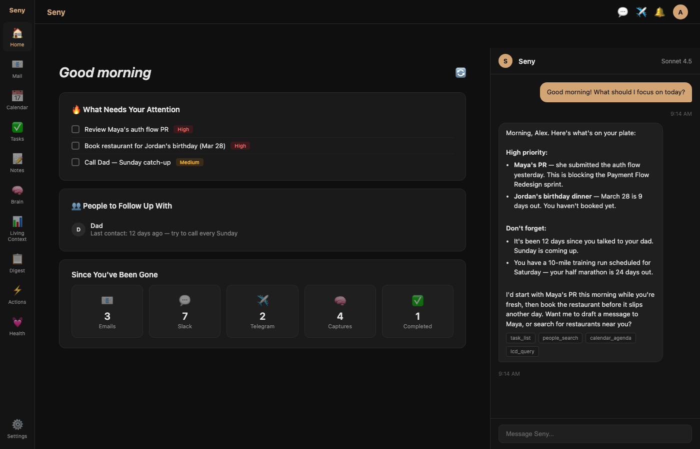

<div align="center">


# Seny

**Your self-hosted AI executive assistant. Private. Proactive. Yours.**

[](LICENSE)
[](https://python.org)
[-D4A574.svg)](https://anthropic.com)
[](https://railway.app)

A personal AI assistant that connects to your email, calendar, Slack, and Telegram, then ties everything together so you never miss what matters. Built for people who want an AI that works *for* them without handing their data to a third party.

[Get Started](#quick-start-railway--recommended) · [Features](#features) · [Integrations](#adding-integrations-optional) · [Troubleshooting](#troubleshooting)

</div>

---

## Why Seny?

The explosion of AI agents in 2025–2026 proved something important: giving an AI unrestricted access to your computer, your email, and your messaging apps — with no guardrails — is a disaster waiting to happen. Agents like OpenClaw shipped with shell access, browser control, and file system permissions out of the box. The result was predictable: deleted inboxes, leaked credentials, private conversations posted publicly, and over 40,000 exposed instances with zero authentication.

**Seny takes a different approach.**

It connects to your email, calendar, Slack, and Telegram — but it can't execute arbitrary commands on your machine, it can't browse the web as you, and it can't take destructive actions without your approval. When Seny wants to send an email, create a calendar event, or act on your behalf, it proposes the action and waits for you to approve or dismiss it. You stay in the loop on everything that matters, without being buried in confirmation dialogs for every small thing.

Self-hosted, private, and designed with the principle that your AI assistant should work *for* you, not *as* you.

> Seny started as a personal project, built over months for my own daily use, deeply integrated with my own email, calendar, relationships, and workflows. To make it available publicly, I stripped out every piece of personal data, replaced hardcoded context with a setup wizard, and tested the result from scratch. But a codebase that was built around one person's life for months is hard to fully sanitize and re-generalize in one pass. If you run into bugs, rough edges, or something that doesn't quite make sense, that's likely a remnant of that process. Please open an issue on GitHub and I'll fix it.



---

## Features

| | Feature | Description |
|---|---------|-------------|
| 💬 | **AI Chat** | Conversations with Claude that know your context, your people, and your priorities |
| 📧 | **Gmail** | Search, read, and send emails right from the chat |
| 📅 | **Google Calendar** | View, create, and manage events without leaving the conversation |
| 📨 | **Microsoft Outlook** | Full email and calendar support for Microsoft accounts |
| 📝 | **Notes** | Obsidian-inspired note-taking with [[wiki-links]], #tags, full-text search, and graph view |
| ✅ | **Tasks** | To-do items, reminders, progress tracking, recurring tasks |
| 💼 | **Slack** | Search, read, and send messages across your workspaces |
| ✈️ | **Telegram** | Search, read, and send messages in your Telegram chats |
| 👥 | **People Tracker** | Relationships, last contact dates, follow-up reminders |
| 🎯 | **Projects & Goals** | Track what you're working on; Seny surfaces relevant info automatically |
| 📋 | **Daily Digest** | Morning briefing: calendar, tasks, follow-ups, what needs attention |
| 🔔 | **Proactive Nudges** | Smart reminders based on your priorities and behavioral patterns |
| 🖥️ | **Screen Agent** | Desktop companion that nudges you when you drift off-task — built as an ADHD accountability tool, learns what "productive" means for you (optional, separate install) |
| 🌐 | **Web Search** | Claude searches the web and cites sources in your conversations |
| 🔍 | **Semantic Search** | AI-powered deep search across all your conversations (optional) |
| 📊 | **Browser History Sync** | Give Seny context about what you've been reading (optional) |

---

**A note on these instructions:** This guide is written for the widest possible audience, including people who have never deployed a web application before. If a step seems overly detailed, that's intentional — we'd rather over-explain than leave anyone stuck.

## Quick Start (Railway — Recommended)

Railway is a hosting service that runs your app in the cloud so it is available 24/7 from any device. This guide walks you through every step. No coding or terminal knowledge required.

### What You Will Need Before Starting

1. **A GitHub account** — This is where the code lives. If you do not have one, go to [github.com](https://github.com) and sign up (free).

2. **An Anthropic API key** — This is what lets Seny talk to Claude (the AI). Here is how to get one:
   - Go to [console.anthropic.com](https://console.anthropic.com)
   - Create an account or sign in
   - Click **API Keys** in the left sidebar
   - Click **Create Key**
   - Give it a name like "Seny" and click **Create**
   - Copy the key immediately — you will not be able to see it again. It starts with `sk-ant-`
   - You will need to add a payment method and purchase credits (Claude API usage is pay-as-you-go)

### Step 1: Fork the Repository

"Forking" means making your own copy of the Seny code on GitHub. This is your copy — you can change anything without affecting the original.

1. Make sure you are signed in to GitHub
2. Go to the Seny repository page on GitHub
3. Click the **Fork** button in the top-right corner
4. On the next screen, leave everything as default and click **Create fork**
5. Wait a few seconds. You now have your own copy at `github.com/YOUR-USERNAME/Seny`

### Step 2: Create a Railway Account

Railway is the service that will run Seny for you in the cloud.

**Pricing:** Railway does not have a permanent free tier. New accounts get a one-time $5 credit that expires in 30 days. After that, you will need the **Hobby plan ($5/month)**, which includes $5 of resource usage. For a single-user Seny instance with PostgreSQL, expect to pay roughly **$5-10/month** total. This does not include the cost of your Anthropic API key, which is separate and pay-as-you-go based on how much you chat.

1. Go to [railway.app](https://railway.app)
2. Click **Login** (top right)
3. Choose **Login with GitHub** — this connects Railway to the GitHub account where you just forked Seny
4. Authorize Railway when prompted

### Step 3: Create a New Project in Railway

1. Once logged in, you should see your Railway dashboard
2. Click **New Project** (top right)
3. Choose **Deploy from GitHub Repo**
4. Find and select your forked **Seny** repository from the list
5. Railway will start setting up your project — do not click Deploy yet, there are a few more steps first

### Step 4: Add a PostgreSQL Database

Without a database, all your conversations, notes, tasks, and settings would be lost every time the app restarts. PostgreSQL gives you a permanent, reliable database.

1. In your Railway project, click **+ Add Service** (the button with a plus icon)
2. Choose **Database**
3. Select **PostgreSQL**
4. Railway will create the database and automatically set a `DATABASE_URL` variable — you do not need to configure anything manually

That is it. Seny detects the `DATABASE_URL` and uses PostgreSQL automatically.

### Step 5: Set Environment Variables

Environment variables are settings that tell Seny how to run. Think of them like filling in a form — the app needs certain information from you.

1. In your Railway project, click on your **Seny service** (not the PostgreSQL one)
2. Go to the **Variables** tab
3. Add the following variables one at a time. For each one, click **New Variable**, type the name on the left and the value on the right, then click the checkmark.

**Required** (the app will not start without these):

| Variable | What to put |
|----------|-------------|
| `ANTHROPIC_API_KEY` | Paste the API key you copied from console.anthropic.com (starts with `sk-ant-`) |
| `SECRET_KEY` | A random string that keeps your login secure. See below for how to generate one. |

**How to generate a SECRET_KEY:**

You need a long random string. Here are three ways to get one — pick whichever is easiest for you:

- **Option A (Mac):** Open the Terminal app (search for "Terminal" in Spotlight), paste this command, and press Enter:
  ```
  python3 -c "import secrets; print(secrets.token_hex(32))"
  ```
  Copy the long string of letters and numbers it prints out.

- **Option B (Windows):** Open PowerShell (search for "PowerShell" in the Start menu), paste this command, and press Enter:
  ```
  python -c "import secrets; print(secrets.token_hex(32))"
  ```
  Copy the long string it prints out.

- **Option C (No terminal needed):** Go to [generate-secret.vercel.app/32](https://generate-secret.vercel.app/32) in your browser. Copy the string it shows you.

**Recommended** (you should set these too):

| Variable | What to put |
|----------|-------------|
| `APP_URL` | Your Railway app URL. You can find this after the first deploy — go to your service, click **Settings**, and look under **Networking** for the public URL. It looks like `https://your-app-name.up.railway.app` |
| `CORS_ORIGINS` | Set this to the same value as `APP_URL`. This allows your browser to communicate with the server. |

### Step 6: Deploy

1. After setting your environment variables, click **Deploy** in the top right (or Railway may deploy automatically)
2. Wait 2-4 minutes for the build to complete. You will see logs scrolling — this is normal
3. When you see a green **Active** status, your app is running
4. To find your app URL: click on your Seny service, then **Settings**, then look under **Networking** for the generated domain. It will look like `https://something.up.railway.app`
5. Click that URL to open Seny in your browser

If Railway did not generate a domain automatically, click **Generate Domain** under the Networking section.

### Step 7: Register Your Account

There is no default admin account — the first person to register becomes the first user.

1. Open your Seny URL in a browser
2. You will see a login page. Click **Register** (or **Sign Up**)
3. Enter an email address and password
4. Click **Register**
5. You will be logged in automatically

### Step 8: Complete the Setup Wizard

After your first login, Seny will walk you through a setup wizard. This is where you personalize your assistant:

- **Your name and pronouns** — So Seny knows how to address you
- **About you** — A brief description of who you are and what you do (helps Seny give better answers)
- **Key people** — The important people in your life (family, close friends, colleagues). Seny uses this to track relationships.
- **Projects and goals** — What you are working on right now

You can always change these later in **Settings**.

### You Are Done!

Start chatting with Seny. Try things like:
- "What's on my calendar today?" (after connecting Google Calendar)
- "Remind me to call Mom on Friday"
- "Create a note about the meeting I just had"
- "What did we talk about last week?"

## Alternative: Run with Docker (Local)

If you want to run Seny on your own computer instead of Railway, you can use Docker. This is more advanced and means Seny only works when your computer is on.

1. Install [Docker Desktop](https://docker.com/products/docker-desktop)

2. Clone the repository:
   ```bash
   git clone https://github.com/YOUR-USERNAME/Seny.git
   cd Seny
   ```

3. Build and run:
   ```bash
   docker build -t seny .
   docker run -d \
     -p 8000:8000 \
     -e ANTHROPIC_API_KEY=your-key-here \
     -e SECRET_KEY=your-secret-here \
     -v seny-data:/app/data \
     --name seny \
     seny
   ```

4. Open [http://localhost:8000](http://localhost:8000) in your browser

5. Register an account and complete the setup wizard

Note: Without a PostgreSQL database, Seny uses SQLite (a simpler database stored in a file). The `-v seny-data:/app/data` part in the command above makes sure your data survives container restarts. For a more robust setup, consider adding a PostgreSQL container.

## Adding Integrations (Optional)

Every integration is optional. You can start using Seny with just the chat, and add integrations whenever you want. All integrations are configured from **Settings** in the Seny web interface.

### Gmail and Google Calendar

Lets Seny search, read, and send emails, and manage your Google Calendar events.

**Requires:** A Google Cloud project with OAuth credentials. This involves some setup in the Google Cloud Console.

**Guide:** See [docs/guides/GMAIL_SETUP.md](docs/guides/GMAIL_SETUP.md) for detailed step-by-step instructions.

**Environment variables needed:**
| Variable | Description |
|----------|-------------|
| `GOOGLE_CLIENT_ID` | From your Google Cloud OAuth credentials |
| `GOOGLE_CLIENT_SECRET` | From your Google Cloud OAuth credentials |

### Microsoft Outlook (Email and Calendar)

Same email and calendar features, but for Microsoft / Outlook / Office 365 accounts.

**Requires:** An Azure AD app registration.

**Guide:** See [docs/guides/MICROSOFT_SETUP.md](docs/guides/MICROSOFT_SETUP.md) for detailed step-by-step instructions.

**Environment variables needed:**
| Variable | Description |
|----------|-------------|
| `MICROSOFT_CLIENT_ID` | From your Azure AD app registration |
| `MICROSOFT_CLIENT_SECRET` | From your Azure AD app registration |

### Slack

Lets Seny search, read, and send messages in your Slack workspaces.

**Requires:** Creating a Slack App with OAuth permissions.

**Guide:** See [docs/guides/SLACK_SETUP.md](docs/guides/SLACK_SETUP.md) for detailed step-by-step instructions.

**Environment variables needed:**
| Variable | Description |
|----------|-------------|
| `SLACK_CLIENT_ID` | From your Slack App settings |
| `SLACK_CLIENT_SECRET` | From your Slack App settings |
| `SLACK_SIGNING_SECRET` | From your Slack App settings (used to verify incoming events) |

### Telegram

Lets Seny search, read, and send messages in your Telegram chats. Also supports a Telegram bot that you can message directly.

**Requires:** A Telegram Bot (created via @BotFather) and API credentials (from my.telegram.org).

**Guide:** See [docs/guides/TELEGRAM_SETUP.md](docs/guides/TELEGRAM_SETUP.md) for detailed step-by-step instructions.

**Environment variables needed:**
| Variable | Description |
|----------|-------------|
| `TELEGRAM_BOT_TOKEN` | From @BotFather when you create your bot |
| `TELEGRAM_API_ID` | From my.telegram.org (needed for reading chat history) |
| `TELEGRAM_API_HASH` | From my.telegram.org (needed for reading chat history) |
| `TELEGRAM_WEBHOOK_SECRET` | A random string for securing webhook callbacks (generate like SECRET_KEY) |

### Push Notifications

Browser push notifications for nudges and reminders.

**Requires:** VAPID keys (a pair of cryptographic keys for web push).

**Environment variables needed:**
| Variable | Description |
|----------|-------------|
| `VAPID_PUBLIC_KEY` | Public key for web push notifications |
| `VAPID_PRIVATE_KEY` | Private key for web push notifications |
| `VAPID_EMAIL` | Contact email for push service (e.g., `mailto:you@example.com`) |

### Screen Agent (Desktop Companion)

An optional desktop app that watches what you are working on and sends context to Seny. Separate installation.

**Guide:** See [screen_agent/SETUP.md](screen_agent/SETUP.md) for installation instructions.

### Semantic Search (AI Embeddings)

Enables deeper search across your conversations using AI vector embeddings. Without this, Seny still works with keyword-based search.

**Environment variables needed:**
| Variable | Description |
|----------|-------------|
| `VOYAGE_API_KEY` | API key from [voyageai.com](https://voyageai.com) for embedding generation |

## Environment Variables Reference

A complete list of every environment variable Seny understands, organized by category.

### Required

These must be set or the app will not start.

| Variable | Description |
|----------|-------------|
| `ANTHROPIC_API_KEY` | Your Claude API key from [console.anthropic.com](https://console.anthropic.com). Starts with `sk-ant-`. |
| `SECRET_KEY` | A random string used to sign login tokens. Generate with `python3 -c "import secrets; print(secrets.token_hex(32))"` |

### Automatically Set by Railway

You do not need to set these yourself if you are using Railway with PostgreSQL.

| Variable | Description |
|----------|-------------|
| `DATABASE_URL` | PostgreSQL connection string. Railway sets this automatically when you add a PostgreSQL database. |
| `PORT` | The port the server listens on. Railway sets this automatically. |
| `RAILWAY_ENVIRONMENT` | Set by Railway to indicate production environment. |

### Recommended

Not strictly required, but you should set these for a proper deployment.

| Variable | Description | Example |
|----------|-------------|---------|
| `APP_URL` | Your app's public URL. Used for OAuth redirects, webhook URLs, and email links. | `https://your-app.up.railway.app` |
| `CORS_ORIGINS` | Comma-separated list of allowed browser origins. Usually the same as APP_URL. | `https://your-app.up.railway.app` |
| `CLAUDE_MODEL` | Which Claude model to use. Defaults to `claude-sonnet-4-5-20250929` if not set. | `claude-sonnet-4-5-20250929` |

### Google (Gmail, Calendar, Contacts, Drive, YouTube)

| Variable | Description |
|----------|-------------|
| `GOOGLE_CLIENT_ID` | OAuth client ID from Google Cloud Console |
| `GOOGLE_CLIENT_SECRET` | OAuth client secret from Google Cloud Console |

### Microsoft (Outlook Email and Calendar)

| Variable | Description |
|----------|-------------|
| `MICROSOFT_CLIENT_ID` | Application (client) ID from Azure AD |
| `MICROSOFT_CLIENT_SECRET` | Client secret from Azure AD |

### Slack

| Variable | Description |
|----------|-------------|
| `SLACK_CLIENT_ID` | OAuth client ID from your Slack App |
| `SLACK_CLIENT_SECRET` | OAuth client secret from your Slack App |
| `SLACK_SIGNING_SECRET` | Signing secret for verifying Slack event payloads |

### Telegram

| Variable | Description |
|----------|-------------|
| `TELEGRAM_BOT_TOKEN` | Bot token from @BotFather |
| `TELEGRAM_API_ID` | API ID from my.telegram.org |
| `TELEGRAM_API_HASH` | API hash from my.telegram.org |
| `TELEGRAM_WEBHOOK_SECRET` | Random string for webhook security |

### Push Notifications

| Variable | Description |
|----------|-------------|
| `VAPID_PUBLIC_KEY` | Public key for web push |
| `VAPID_PRIVATE_KEY` | Private key for web push |
| `VAPID_EMAIL` | Contact email for push service (default: `mailto:noreply@seny.app`) |

### Semantic Search (Optional)

| Variable | Description |
|----------|-------------|
| `VOYAGE_API_KEY` | API key from Voyage AI for vector embeddings |
| `OPENAI_API_KEY` | Alternative embedding provider (OpenAI) |
| `CHROMA_PATH` | Path for ChromaDB vector storage (default: `/data/chroma`) |

### Telegram Bot Features (Optional)

| Variable | Description |
|----------|-------------|
| `GIPHY_API_KEY` | Giphy API key for GIF search in Telegram bot |

### Database (Advanced)

| Variable | Description |
|----------|-------------|
| `DATABASE_PATH` | Custom path for SQLite database file (only used when `DATABASE_URL` is not set) |

### Security (Advanced)

| Variable | Description |
|----------|-------------|
| `EMAIL_FEEDBACK_SECRET` | Secret for email feedback links. Auto-generated if not set. |

## Troubleshooting

### App will not start

- **Check your environment variables.** The two most common causes: `ANTHROPIC_API_KEY` is missing or has a typo, or `SECRET_KEY` is not set.
- **Check the Railway logs.** In your Railway dashboard, click on your Seny service, then click the **Logs** tab. Look for error messages — they usually tell you exactly what is wrong.
- **Make sure your API key is valid.** Go to [console.anthropic.com](https://console.anthropic.com) and verify your key is active and has credits.

### "CORS error" in the browser

This happens when your browser blocks requests because the server does not recognize where they are coming from.

- Set `CORS_ORIGINS` to your app URL (e.g., `https://your-app.up.railway.app`)
- If you are using a custom domain, set `CORS_ORIGINS` to that domain instead
- Multiple origins can be separated by commas: `https://your-app.up.railway.app,https://your-custom-domain.com`

### Data disappeared after a redeploy

This means you are running without PostgreSQL. Without it, Seny uses SQLite, which stores data inside the container — and containers are rebuilt on every deploy.

**Fix:** Add a PostgreSQL database (see Step 4 in the Quick Start). Your data will persist across redeploys from that point forward. Unfortunately, data from before adding PostgreSQL cannot be recovered.

### Gmail or Calendar not connecting

- Make sure you followed [docs/guides/GMAIL_SETUP.md](docs/guides/GMAIL_SETUP.md) exactly
- Verify that your **OAuth redirect URI** in Google Cloud Console matches your app URL (e.g., `https://your-app.up.railway.app/api/email/oauth/callback`)
- Check that `GOOGLE_CLIENT_ID` and `GOOGLE_CLIENT_SECRET` are set correctly in Railway variables
- Google OAuth apps in "Testing" mode only work for email addresses you have explicitly added as test users

### Outlook not connecting

- Follow [docs/guides/MICROSOFT_SETUP.md](docs/guides/MICROSOFT_SETUP.md) for Azure AD setup
- Verify your redirect URI matches: `https://your-app.up.railway.app/api/microsoft/oauth/callback`
- Check that `MICROSOFT_CLIENT_ID` and `MICROSOFT_CLIENT_SECRET` are set correctly

### Health check failing on Railway

Railway automatically pings the `/health` endpoint to check if your app is alive. If health checks fail:

- Check the logs for startup errors
- The app needs about 30-60 seconds to start up — Railway is configured to wait before checking
- If the app starts and then crashes, look for errors related to missing environment variables or database connection issues

### Slack messages not appearing

- Verify `SLACK_CLIENT_ID`, `SLACK_CLIENT_SECRET`, and `SLACK_SIGNING_SECRET` are all set
- Make sure your Slack App has the correct OAuth scopes and event subscriptions
- Check that your Slack App's Request URL points to `https://your-app.up.railway.app/api/slack/events`

### Telegram bot not responding

- Check that `TELEGRAM_BOT_TOKEN` is set correctly
- If using webhooks, make sure `TELEGRAM_WEBHOOK_SECRET` and `APP_URL` are both set
- Without `TELEGRAM_WEBHOOK_SECRET` or `APP_URL`, the bot falls back to polling mode (still works, but slightly slower)

### "Embedding disabled" messages in logs

This is not an error. It means `VOYAGE_API_KEY` is not set, so semantic search is disabled. Seny works perfectly fine without it — you just get keyword search instead of AI-powered search. Set `VOYAGE_API_KEY` if you want the deeper search feature.

### Something else not working?

1. Check the Railway logs first — most problems show clear error messages
2. Make sure all required environment variables are set
3. Try redeploying (push a small change to GitHub, or click **Redeploy** in Railway)
4. Open an issue on the GitHub repository with the error message from your logs

## Project Structure

```
Seny/
├── web/                    # The main application
│   ├── api/                # Backend endpoints (chat, email, calendar, etc.)
│   ├── services/           # Business logic (Claude, Gmail, Slack, etc.)
│   ├── core/               # Database, authentication, scheduler
│   ├── frontend/           # React web interface
│   └── static/             # Static assets
├── screen_agent/           # Optional desktop companion (separate install)
├── docs/                   # Guides and documentation
│   └── guides/             # Integration setup guides
├── Dockerfile              # For Docker deployments
├── requirements.txt    # Python dependencies
└── start.sh                # Server startup script
```

## License

Seny is licensed under the **PolyForm NonCommercial 1.0.0** license. This means you are free to use, modify, and self-host Seny for personal, non-commercial purposes. It cannot be used to provide commercial services or sold. See the [LICENSE](LICENSE) file for full details.
